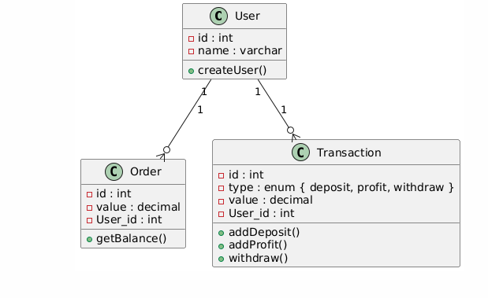

**Aviso:**

Atualmente, estamos utilizando um devcontainer com uma imagem direta do Ruby. Devido a isso, não é possível utilizar o PlantUML diretamente. Portanto, as visualizações estão sendo geradas através do site online: [PlantUML](https://www.plantuml.com/plantuml/uml/).

Se preferir, os códigos PUML estão disponíveis nos links abaixo:

- [Diagrama de Contexto](contextDiagram.puml)
- [Diagrama de Banco de Dados](Bd.puml)

Alternativamente temos os diagramas já montados:

### Contexto:

### UML

---

### Descrição da Aplicação

A aplicação tem como objetivo realizar um estudo aprofundado sobre o Ruby puro, aplicando ao máximo os princípios da Clean Architecture. 

#### Funcionalidades da API:

- **Criação de Conta:** O usuário pode criar uma conta no sistema.
- **Login:** O usuário pode fazer login no sistema.
- **Aplicação de Dinheiro:** O usuário pode aplicar dinheiro na conta.
- **Verificação de Saldo:** O usuário pode verificar o saldo da aplicação, que rende 33% ao mês.
- **Saque:** O usuário pode sacar o dinheiro da aplicação.
